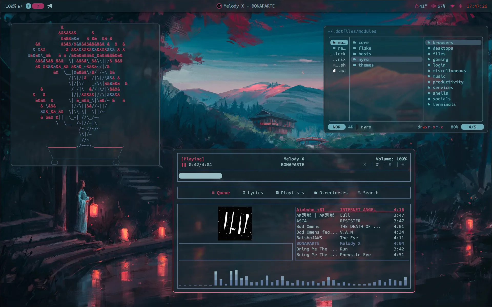
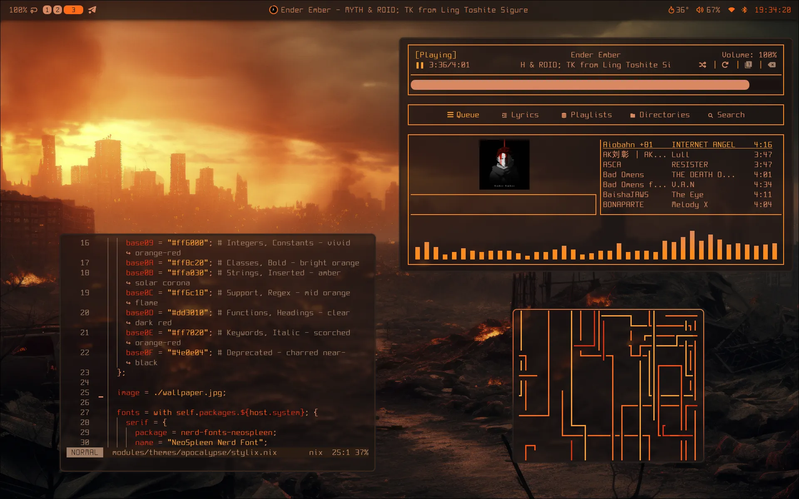
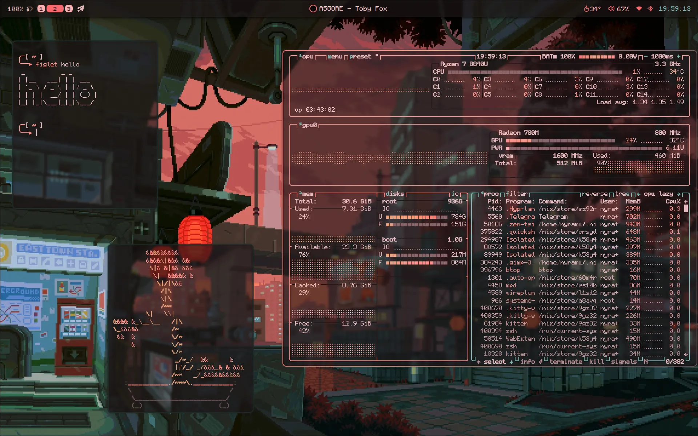

# Nyramu's Dotfiles

This repo contains my dotfiles for NixOS, which are meant for my personal use.
This **also applies to the resources** pushed here. I also wanted to have a cool
readme.

## Features

- Dendritic pattern
- Granular host configuration
- [Nyra Options](./modules/nyra): a comfy way to manage configured modules
- [Nyra CLI](./modules/flake/packages/nyra): useful commands wrapped in an
  easy-to-use CLI
- [Themes](./modules/themes): a whole aesthetic overhaul, applied on top of the
  default configuration

## Themes

If you want to see every theme, check [here](./examples).

<details open>
  <summary><b>Here are some screenshots!</b></summary>

  <figure>
    
    <figcaption>Lanterns</figcaption>
  </figure>

  <figure>
    
    <figcaption>Apocalypse</figcaption>
  </figure>
  
  <figure>
    
    <figcaption>Eastern City</figcaption>
  </figure>
  
</details>

## Installation

This is the recommended way to install my dotfiles:

```sh
nix shell nixpkgs#git
cd
git clone git@github.com:Nyramu/.dotfiles.git
# If you don't have SSH configured, use instead:
# git clone https://github.com/Nyramu/.dotfiles.git
cd .dotfiles/
./install.sh
```

## Special Thanks

- I deeply thank [gabrielemercolino](https://www.github.com/gabrielemercolino)
  for helping me understand NixOS and inspiring my configurations through
  [his dotfiles](https://www.github.com/gabrielemercolino/.dotfiles).

## Credits

- [Zaney's dotfiles](https://gitlab.com/Zaney/zaneyos)
- My [Red Eclipse theme's wallpaper](./modules/themes/red-eclipse/wallpaper.jpg)
  is based on one found on
  [Reddit](https://www.reddit.com/r/wallpaper/comments/1p0iimv/darkred_sky_eclipse_3840_x_2160)/[wallpaperflare.com](https://www.wallpaperflare.com/digital-digital-art-artwork-fantasy-art-drawing-painting-wallpaper-gjwkg).
  I don't know who the original author is. If you are the original author and
  want credits or removal of the wallpaper, please open a pull request.
- My [Apocalypse theme's wallpaper](./modules/themes/apocalypse/wallpaper.jpg)
  is an Image from
  [freepik.com](https://www.freepik.com/free-ai-image/darkly-atmospheric-retail-environment-rendering_133620216.htm)
